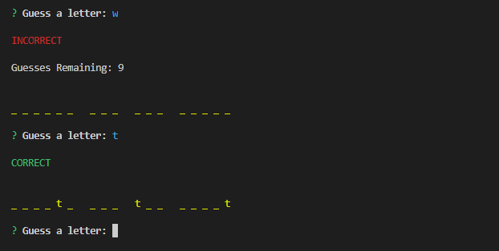

# Constructor Word Guess
This is a command line Word Guess game that utilizes constructor functions. Guess the movie title without getting more than 10 incorrect guesses.

## Installation
After cloning this repo, run:
```console
npm install
```

## Usage
The phrase will be shown with underscores. Guessing a correct letter will fill in the blanks.

